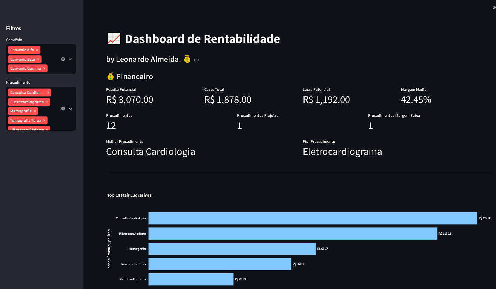
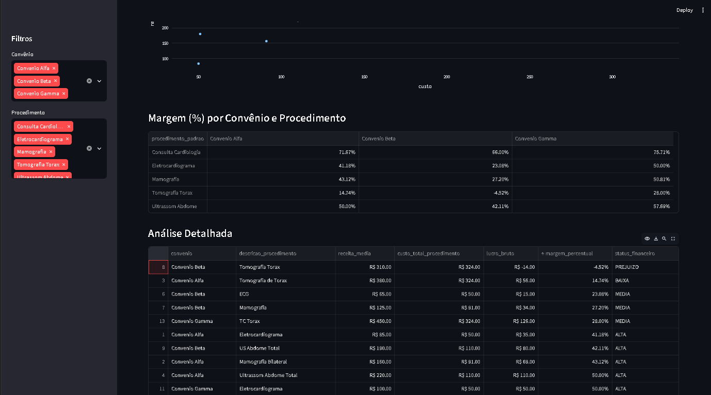
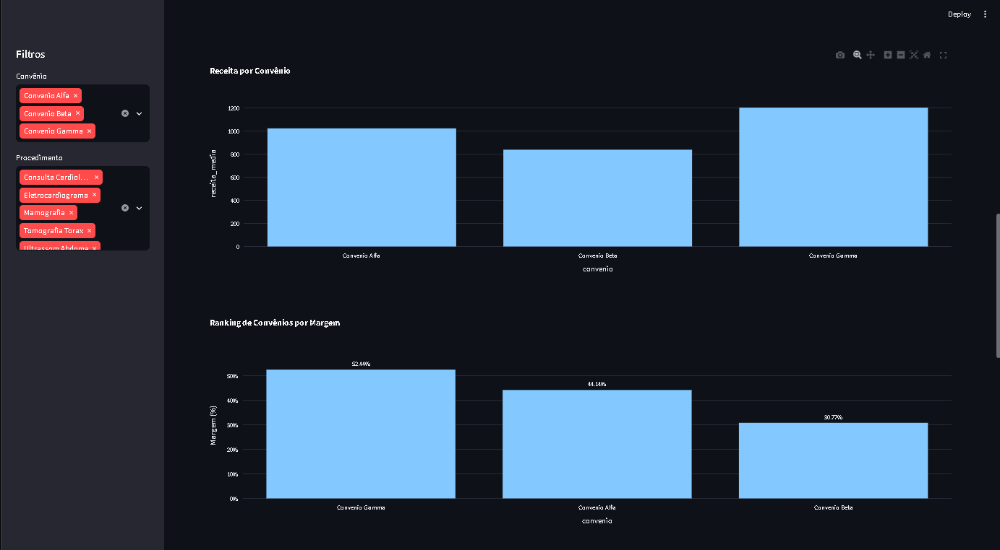

# 📊 Profitability Analytics

A Python-based data analytics project designed to evaluate the profitability of medical procedures by combining procedure revenue, operational costs, and business rules into a consolidated analytical workflow.

The project transforms raw pricing and cost data into financial indicators and an interactive Streamlit dashboard, allowing users to identify profitable procedures, low-margin operations, and potential financial losses.

> This repository contains only fictional demonstration data. No patient or confidential company information is included.

---

## 🎯 Business Problem

Healthcare organizations may receive different reimbursement values for the same procedure depending on the insurance provider.

At the same time, each procedure has operational costs such as:

- Materials and supplies;
- Staff time;
- Medical professional costs;
- Operational resources.

Without consolidating these variables, it becomes difficult to answer questions such as:

- Which procedures generate the highest margins?
- Which procedures operate at a loss?
- How does profitability vary between insurance providers?
- Which procedures should have their costs or reimbursement values reviewed?

This project was created to turn fragmented pricing and cost information into structured profitability indicators.

---

## 💡 Solution

The application implements a data pipeline that:

1. Imports procedure and reimbursement data;
2. Consolidates data from multiple insurance providers;
3. Calculates the operational cost of each procedure;
4. Normalizes procedure descriptions;
5. Maps different descriptions to standardized procedures;
6. Detects duplicate and conflicting mappings;
7. Identifies procedures without mappings or registered costs;
8. Calculates revenue, cost, gross profit, and profit margin;
9. Classifies procedures according to profitability;
10. Makes the results available through an interactive dashboard.

---

## 🔄 Data Pipeline

```text
Insurance CSV Files
        │
        ▼
Data Import & Consolidation
        │
        ▼
Procedure Standardization
        │
        ▼
Cost Calculation
        │
        ▼
Mapping Validation
        │
        ▼
Profitability Analysis
        │
        ▼
Analytical Dataset
        │
        ▼
Streamlit Dashboard
```

The project separates processing logic from visualization, allowing the analytical pipeline to be executed independently from the dashboard.

---

## ⚙️ Main Features

### Data Processing

- Multiple insurance-provider CSV import;
- Data consolidation with Pandas;
- Procedure description normalization;
- Standardized procedure mapping;
- Automatic removal of intentionally excluded procedures.

### Data Quality

- Duplicate mapping detection;
- Conflicting mapping validation;
- Reporting of unmapped procedures;
- Identification of procedures without registered costs.

### Financial Analysis

For each procedure, the project calculates:

```text
Gross Profit = Average Revenue - Procedure Cost
```

```text
Profit Margin (%) = Gross Profit / Average Revenue × 100
```

Procedures are classified into:

| Margin | Classification |
|---|---|
| `< 0%` | PREJUIZO |
| `0% – <20%` | BAIXA |
| `20% – <40%` | MEDIA |
| `>= 40%` | ALTA |

---

## 📈 Interactive Dashboard

The Streamlit dashboard provides an executive view of the profitability analysis.

Available indicators include:

- Potential revenue;
- Total procedure cost;
- Potential gross profit;
- Average profit margin;
- Number of analyzed procedures;
- Procedures operating at a loss;
- Low-margin procedures;
- Most profitable procedure;
- Least profitable procedure.

### Dashboard Overview



The dashboard also includes:

- Top 10 most profitable procedures;
- Top 10 least profitable procedures;
- Revenue analysis by insurance provider;
- Insurance-provider ranking by margin;
- Revenue vs. cost analysis;
- Profitability matrix by procedure and insurance provider;
- Detailed analytical table;
- Interactive filters.

### Profitability Analysis





---

## 🗂️ Project Structure

```text
Profitability_Analytics/
│
├── dados/
│   └── .gitkeep
│
├── dados_demo/
│   ├── Convênios/
│   │   ├── Convenio_Alfa.CSV
│   │   ├── Convenio_Beta.CSV
│   │   └── Convenio_Gamma.CSV
│   ├── custos_procedimentos.xlsx
│   └── mapeamento_procedimentos.xlsx
│
├── dashboard/
│   ├── __init__.py
│   └── app.py
│
├── scripts/
│   ├── __init__.py
│   ├── importar_convenios.py
│   ├── calcular_custos.py
│   └── analise.py
│
├── tests/
│   ├── __init__.py
│   └── test_analise.py
│
├── v2_agendas/
│   ├── 04_importar_agendas.py
│   └── 05_analise_agendas.py
│
├── .gitignore
├── config.py
├── requirements.txt
└── README.md
```

---

## 🛠️ Technologies

- Python
- Pandas
- NumPy
- OpenPyXL
- Streamlit
- Plotly
- Pytest
- Excel / CSV

---

## 🧪 Automated Tests

Core business rules are validated using **pytest**.

The current test suite covers:

- Text normalization;
- Profit-margin classification;
- Boundary conditions for financial classifications;
- Procedure exclusion rules;
- Gross-profit calculations;
- Profit-margin calculations;
- Duplicate mapping handling;
- Conflicting mapping detection.

Run the tests with:

```bash
pytest -v
```

Current status:

```text
11 tests passed
```

---

## 🔐 Demo Data & Security

The original solution was developed from a real operational business scenario.

For portfolio purposes, the repository uses a completely separate demonstration environment.

```text
Production Environment
        │
        └── Real operational data

GitHub Repository
        │
        └── Fictional demonstration data
```

The public repository does **not** contain:

- Patient information;
- Real insurance-provider datasets;
- Employee information;
- Real salary information;
- Medical professional compensation;
- Confidential company information.

The included demo datasets were created exclusively to demonstrate the application's workflow.

---

## 🚀 How to Run

### 1. Clone the repository

```bash
git clone https://github.com/LeonardoAlmeida1/Profitability_Analytics.git
cd Profitability_Analytics
```

### 2. Create a virtual environment

```bash
python -m venv .venv
```

Windows:

```bash
.venv\Scripts\activate
```

### 3. Install dependencies

```bash
pip install -r requirements.txt
```

### 4. Import demo insurance data

```bash
python -m scripts.importar_convenios
```

### 5. Calculate procedure costs

```bash
python -m scripts.calcular_custos
```

### 6. Generate the profitability analysis

```bash
python -m scripts.analise
```

### 7. Start the dashboard

```bash
streamlit run dashboard/app.py
```

---

## 🚧 Version 2 — Appointment Intelligence

An additional analytical module is currently under development to expand the project beyond financial profitability.

The planned analysis includes appointment and operational indicators such as:

- Appointment volume;
- Unique patients;
- Insurance-provider participation;
- Procedure demand;
- Physician activity;
- Monthly and yearly evolution;
- Most active weekdays;
- Peak appointment hours;
- Operational scheduling patterns.

This module is currently maintained under:

```text
v2_agendas/
```

---

## 🔄 Future Improvements

- Expand automated test coverage;
- Add integration tests for the complete pipeline;
- Improve dashboard navigation;
- Add additional financial indicators;
- Complete the Appointment Intelligence module;
- Add historical profitability analysis;
- Improve data-quality reporting;
- Add automated pipeline execution.

---

## 👨‍💻 Author

**Leonardo Silva de Almeida**

Python Developer focused on **Automation and Data**, with hands-on experience in data processing, process automation, APIs, databases, business intelligence, and system integration.

### Career Focus

- Junior Python Developer
- Junior Data / BI Analyst
- Process Automation
- Data Analytics
- System Integration

GitHub: [LeonardoAlmeida1](https://github.com/LeonardoAlmeida1)

LinkedIn: [Leonardo Silva de Almeida](https://www.linkedin.com/in/leonardo-silva-de-almeida-8416221b5/)
